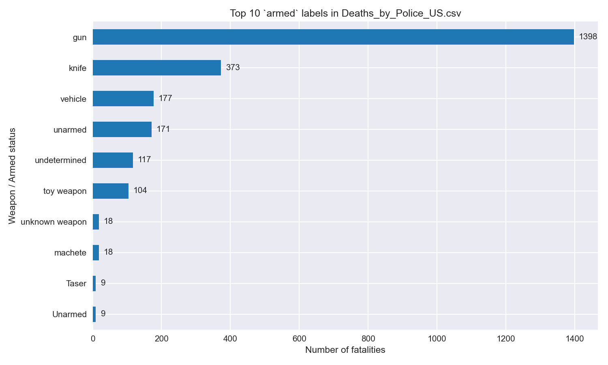

# DataScience — Police Fatality Analysis (USA)


Professional, reproducible analysis of police-involved fatalities in the United States (2015–2017 snapshot) that combines a fatalities dataset with city-level socio-economic indicators to explore patterns and disparities.

--

## At a glance

- Purpose: analyze police-involved fatality records and compare outcomes with local socio-economic and demographic variables (poverty, education, median household income, racial composition).
- Primary analysis: `Fatal_Force_(start).ipynb` (Jupyter Notebook) — exploratory data cleaning, aggregation, and visualizations (Plotly + Seaborn).
- Main datasets (CSV):
  - `Deaths_by_Police_US.csv` — incident-level fatalities dataset (id, name, date, manner_of_death, armed, age, gender, race, city, state, signs_of_mental_illness, threat_level, flee, body_camera)
  - `Median_Household_Income_2015.csv` — city-level median income
  - `Pct_Over_25_Completed_High_School.csv` — percent of residents over 25 who completed high school
  - `Pct_People_Below_Poverty_Level.csv` — city-level poverty rates
  - `Share_of_Race_By_City.csv` — city-level racial composition (share_white, share_black, ...)

## Example visualization



--

## Highlights and findings (summary)

- The notebook performs careful data cleaning (parsing dates, normalizing weapon labels, converting census-percentage columns to numeric). It compares state-level averages of poverty and high-school completion and produces choropleth maps and bar charts to show geographic patterns.
- The analysis pipeline includes grouping by city/state, computing per-race fatality shares, and comparing fatality counts against local demographic measures.

## Notebook structure (what's implemented)

1. Imports and environment setup (pandas, numpy, seaborn, plotly.express)
2. Data loading (CSV -> DataFrame)
3. Safe cleaning of socio-economic columns (replace `-` placeholders, convert to numeric, avoid chained assignment)
4. Aggregation to state-level means for poverty and high-school completion
5. Visualizations:
   - Horizontal bar charts ranking states by poverty and high-school completion
   - Dual-axis line chart comparing poverty vs. completion across states
   - Choropleth map of fatalities by state
   - Pie / donut charts for fatalities by race and mental-illness status
   - Box plots and histograms for age distributions
   - Top cities and race-rate breakdowns

## How to run (reproducible)

These commands assume you're on Windows PowerShell and inside the project root (this repository).

1) Create & activate a virtual environment (recommended):

```powershell
python -m venv .venv
.\.venv\Scripts\Activate.ps1
```

2) Install required Python packages:

```powershell
pip install --upgrade pip
pip install pandas plotly seaborn matplotlib jupyterlab notebook
# (Optional) Save installed packages
pip freeze > requirements.txt
```

3) Open the notebook interactively in JupyterLab:

```powershell
jupyter lab
# then open `Fatal_Force_(start).ipynb` in the browser and run cells
```

4) Run the notebook headlessly (reproducible executed notebook + HTML):

```powershell
jupyter nbconvert --to notebook --execute "Fatal_Force_(start).ipynb" --output "Fatal_Force_executed.ipynb" --ExecutePreprocessor.timeout=600
jupyter nbconvert --to html "Fatal_Force_executed.ipynb" --output "Fatal_Force_executed.html"
```

Notes:
- If the notebook is marked `not trusted` in JupyterLab, enable trust (File → Trust Notebook) to allow rendering of rich outputs.
- Restart the kernel and run the data-loading cell first. There is a dedicated cleaning cell that safely converts `poverty_rate` and `percent_completed_hs` to numeric types.

## Data cleaning notes (important details)

- The census CSVs contain placeholder values like `-` and some string-typed columns. The notebook now adopts a safe pattern: copy the DataFrame (avoid SettingWithCopy), replace `-` with `'0'` (string), then apply `pd.to_numeric(..., errors='coerce').fillna(0)` to obtain numeric columns.
- Weapon labels and `armed` values are cleaned/aggregated; the notebook builds a tidy `weapon / percent` table before plotting to avoid attribute-based access errors.
- Dates are parsed with the format `%d/%m/%y` and converted to pandas datetime for time-series analysis.

## Outputs and artifacts

- `Fatal_Force_executed.ipynb` — (optional) executed notebook with outputs saved after a headless run.
- `Fatal_Force_executed.html` — (optional) static HTML export suitable for sharing.

## Recommended improvements / next steps

- Add a `requirements.txt` with pinned versions to guarantee reproducibility.
- Add unit tests / validation scripts that check CSV schema (columns present) and a quick sanity-check on parsed numeric columns.
- Add a small `preprocess.py` to centralize cleaning/normalization logic used by the notebook and any downstream scripts.
- Consider producing reproducible PNG/HTML exports of key figures in a `reports/` folder.

## Contributing

If you'd like to contribute improvements (data updates, cleaned labels, additional visualizations), please open an issue or a pull request. Suggestions for new analyses (e.g., per-capita fatality rates using city population) are welcome.

## License

This repository includes data from public sources. Check the original sources for any licensing terms. The repository itself is provided under the existing license file in the repository (`LICENSE`).

--

If you'd like, I can also:
- generate and embed a real example visualization image produced by the notebook (I can run the notebook headless and save a PNG), or
- add a `requirements.txt` with pinned package versions and a small `preprocess.py` script to consolidate cleaning logic.

Tell me which of the follow-ups you want and I'll implement them next.
